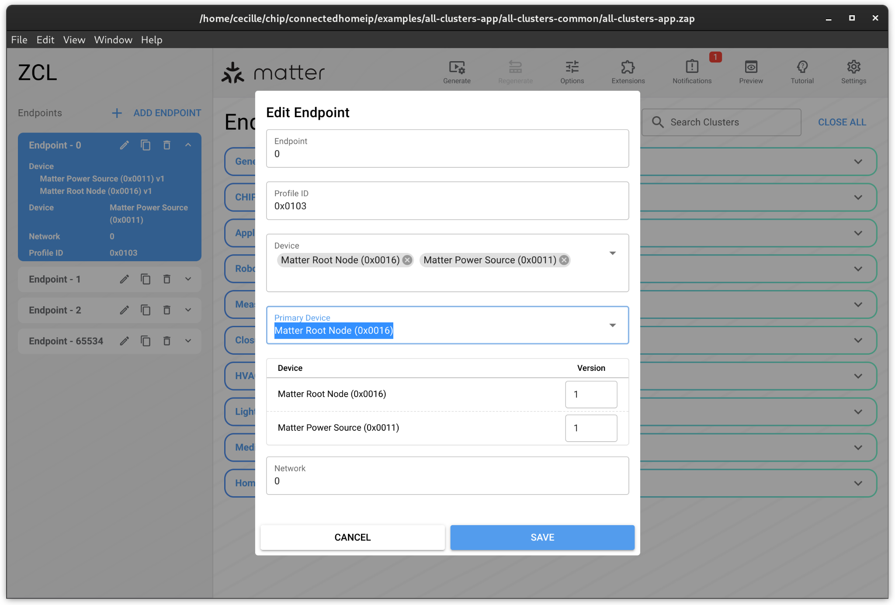
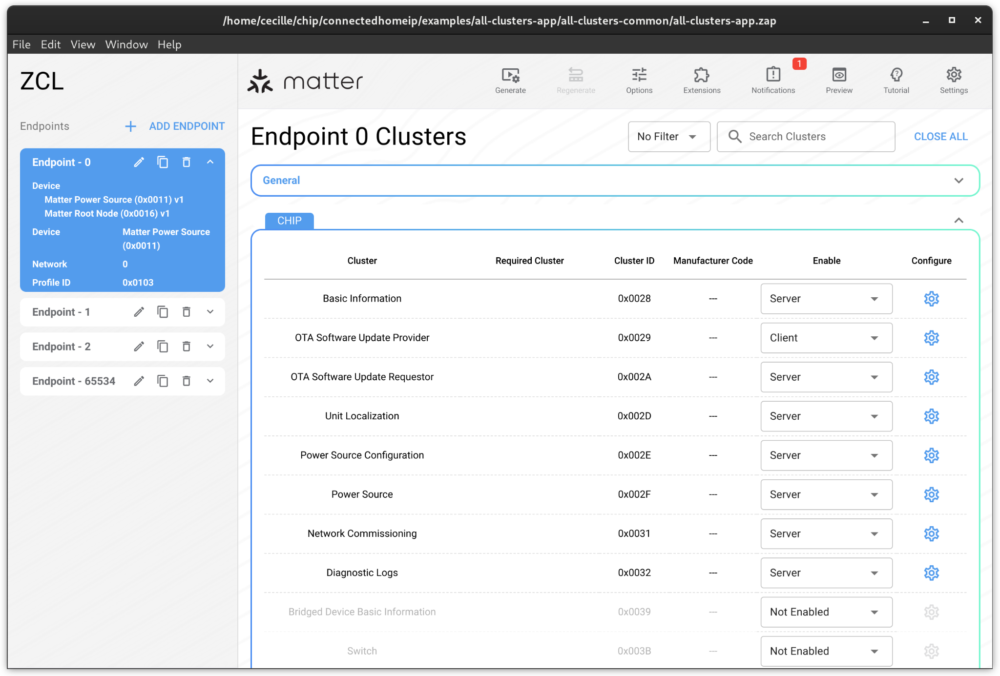
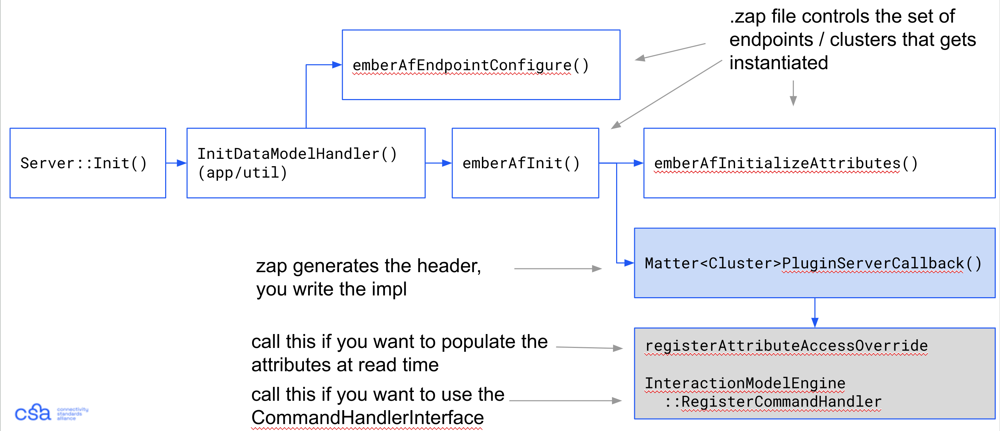
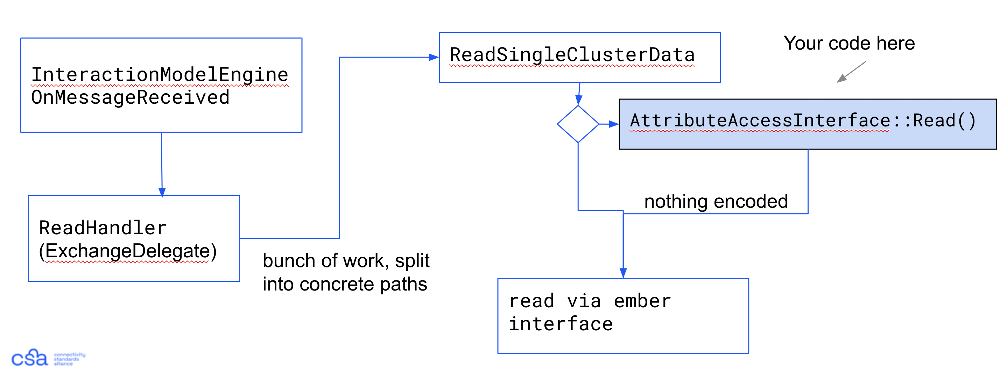
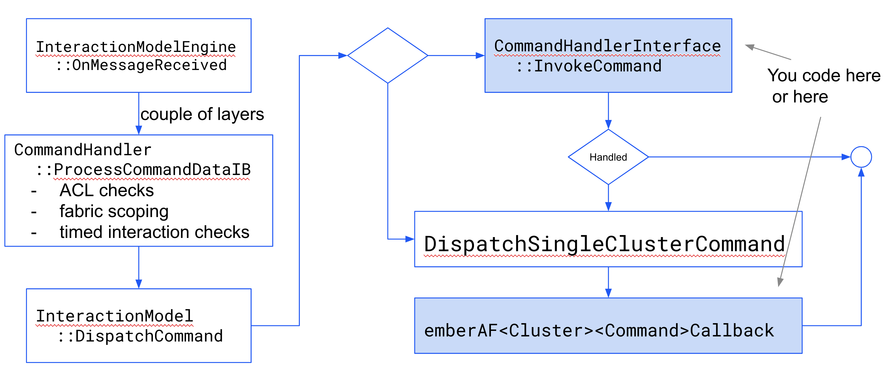

# New Clusters & Device Types

The goal of new cluster and device type development is to

1. write the cluster implementations
2. write the code and supporting material that will allow zap to generate the
   appropriate ember layersS
3. write the unit tests, test plans and automations that prove the code
   correctness and allow these new features to be certified

Unit tests, test plans and certification tests are covered in the testing section.
This document will concentrate on implementing clusters
and device types in the SDK.

-   Cluster Definition
    -   XML
    -   Describes the structures, enums, attributes, commands, events etc.
    -   Direct translation of the spec into code
    -   src/app/zap-templates/zcl/data-model/chip/
-   Cluster Implementation

    -   Client side - codegen, you write the glue
    -   Server side - cpp implementation through Ember and / or
        AttributeAccessInterface & CommandHandlerInterface
        -   src/app/clusters/<your_cluster_name>
        -   build file: src/app/chip_data_model.gni
        -   build file uses data from the codegen to auto-populate the cluster
            list.
        -   Follow examples in there to get your code building into the image
            when selected in zap

-   Device Type Definitions
    -   XML defines conformance
    -   src/app/zap-templates/zcl/data-model/chip/matter-devices.xml

The following wiki page has a detailed description of how and where to add
cluster and device type definitions so they are picked up properly by ZAP/ember
and the SDK.

[https://groups.csa-iot.org/wg/matter-tsg/wiki/howto-add-a-new-device-type](https://groups.csa-iot.org/wg/matter-tsg/wiki/howto-add-a-new-device-type)

The following set of tools can be used to translate spec documents into a ZAP
xml: https://github.com/hasty/alchemy. Note that the output should also be
verified against the spec using the .matter parser tools.

## ZAP, Ember and Overrides

-   Goal: get zap to understand the new cluster so it can be used on devices
    (XML and glue)


### Cluster definitions and ZAP

Please see [ZAP](../getting_started/zap.md) for an introduction to ZAP.

After implementing the changes outlined in the wiki article, your cluster and
device type should show up in zap. you can check this by running zaptool with
any zap file.

./scripts/tools/zap/run_zaptool.sh <filename>

To ensure the cluster and device type are correctly implemented for ZAP, open
the endpoint configuration and ensure the device type appears in the device type
list.



Next, check your cluster. The "domain" parameter in the XML controls which group
the cluster is in. It should have all the expected attributes, commands and
events.



Last, ensure that your attributes have the storage option set appropriately.


### Cluster implementation - Ember and overrides

-   Ember: layer used to setup/access the endpoints / attributes / commands etc.
    on the device

    -   The build generates the Ember function signatures and defaults
    -   The Cluster server code implements callbacks for initialization,
        commands, attribute access and event generation
    -   Interaction Model layer will call ember functions when it receives
        incoming interactions for your cluster

-   Overrides
    -   Ember layer is _generated_ at compile time whereas overrides are
        _installed_ at run time
    -   Overrides are called before the ember layer for attribute access or
        command handling
        -   AttributeAccessInterface & CommandHandlerInterface
    -   Allow significantly more control, but are more complex
    -   **UNIT TESTABLE**
    -   Both allow fall through to the ember layer (if setup in zap)

#### Cluster Server Initialization

The following diagram shows the flow of messages coming into the Matter core and
ending in the cluster initialization code.



EmberAfInitializeAttributes - ember attribute storage - for all attributes
marked as “RAM” in the zap, sets defaults in the storage
Matter<Cluster>PluginServerCallback - .h is a generated file, .cpp impl is done
in the server cluster code. Use this to setup the cluster and do attribute
overrides registerAttributeAccessOverride - use this if you want to handle
attribute reads and writes externally

Blue sections can be overridden.

#### Cluster Server Attributes

-   **Two mechanisms**
-   Ember layer
-   Override
-   For attributes marked as **“RAM”** storage in the zap file
    -   Storage allocated automatically, Ember handles read/write
    -   Generated “Get” and “Set” functions for each attribute in Accessors.h
        (generated file)
    -   You _CAN_ register an override on the cluster. If you don’t try to
        encode the attribute in the override, it will fall through to the
        storage.
        -   If you _DO_ always encode the attribute in the access override
            function, you’re wasting space.
-   For attributes marked as **“External”** storage in the zap file
    -   NO storage is allocated, no fallthrough to ember storage
    -   NEED to register an access override for these to work

##### Cluster Server Attributes via Override (read)



[AttributeAccessInterface::Read()](https://github.com/project-chip/connectedhomeip/blob/master/src/app/AttributeAccessInterface.h#L424)

```
CHIP_ERROR Read(const ConcreteReadAttributePath & aPath,
                AttributeValueEncoder & aEncoder)
{
	// Parse aPath to determine the requested attribute
	switch (aPath.mAttributeId)
    {
    case SomeAttribute::Id:
		// Just encode the value
		aEncoder.Encode(mSomeValue);
		break;
	}
	// Beware of lists - the need to use EncodeList to have
    // chunking handled properly
	return CHIP_NO_ERROR;
```

#### Cluster Server Attributes via override (write)

Write are handled using the same path as read, but land in the “Write” function
of the AttributeAccessInterface.

[AttributeAccessInterface::Write()](https://github.com/project-chip/connectedhomeip/blob/master/src/app/AttributeAccessInterface.h#444)

The attribute handler is responsible for constraint checking and Attribute
persistence

##### Attribute Persistence

-   When using AttributeAccessInterface, you need to manage any Attributes that
    require Persistence.
-   This can be done by using GetSafeAttributePersistenceProvider()
-   This provides a useful API for Reading & Writing values of any type to the
    default Persistence Store
    -   [src/app/SafeAttributePersistenceProvider.h](https://github.com/project-chip/connectedhomeip/blob/master/src/app/SafeAttributePersistenceProvider.h)

#### Ember layer read / write

In the ember layer functions, the ember layer handles the encode and decode.
This can work for simple attributes, but is can be challenging for complex
attribute interactions. The ember layer is also VERY difficult to unit test.

The ember layer provides callbacks for attribute changes so you can handle them

```
void MatterPostAttributeChangeCallback(const chip::app::ConcreteAttributePath & attributePath,
                                       uint8_t type, uint16_t size, uint8_t * value)

```

Take care when using this that the callbacks are implemented in a way that can
be used across examples

#### Cluster Server Commands

-   As with Attributes, there is an ember layer option, and an override option
-   **Override**
    -   Registered at runtime
    -   InteractionModelEngine::RegisterCommandHandler
    -   Implement CommandHandlerInterface
-   **Ember**
    -   static
    -   emberAf<ClusterName><CommandName>Callback



##### Command Handler Code

-   CommandHandlerInterface
    -   Can use HandleCommand function for convenience (sets handled)
    -   If not, need to set whether the command was handled
        -   if no, falls through to ember by default
    -   If entirely handled by this interface, add to
        src/app/common/templates/config-data.yaml to disable ember
-   Ember interface
    -   Return true if the command was handled, false to have an invalid command
        response returned
-   For both
    -   Need to handle the return to the caller using either AddResponse or
        AddStatus in the command handler
    -   Need to handle constraints checking and return the appropriate status or
        response per the spec

The
[config-data.yaml](https://github.com/project-chip/connectedhomeip/blob/master/src/app/common/templates/config-data.yaml)
file is used to turn off ember command callback generation for clusters with
pure CommandHandlerInterface implementations.

#### Events and Attribute Subscriptions

-   **Attribute** change reporting
    -   If you go through the ember storage layer (generated Get/Set functions
        on the attribute), this is handled for you
    -   If you are using an AttributeAccessInterface, you need to tell the
        reporting engine that the attribute has changed
        -   **MatterReportingAttributeChangeCallback**
-   **Events**
    -   No direct ember support
    -   Call LogEvent function in EventLogging.h

#### A note on Dynamic Endpoints

-   Dynamic endpoint registration
    -   ZAP configs are static at compile time
    -   Can also use dynamic endpoint registration at runtime
        -   common for bridges
    -   **emberAfSetDynamicEndpoint**
    -   If you have your own storage for attributes etc, need to account for
        dynamic endpoints as well as static
