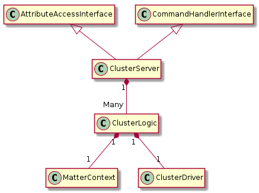
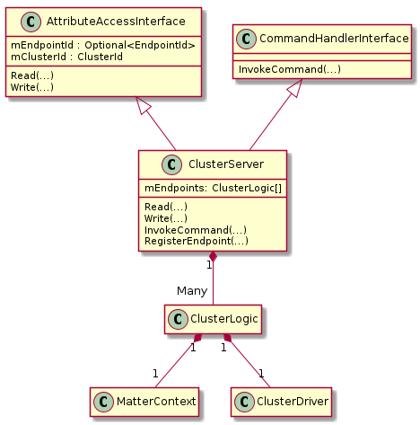
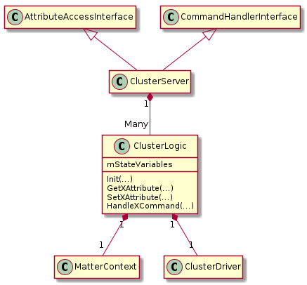
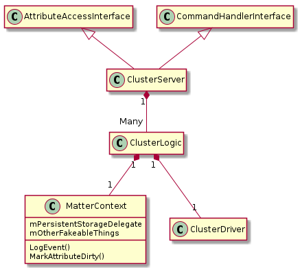

# Designing Clusters for Testing and Portability

## Unit Testable, Modular Cluster Design

When designing new clusters, consider the following approach:

-   Separate the cluster logic from the on-the-wire data model
    -   Server vs. ClusterLogic
    -   Makes the cluster logic unit-testable without generating TLV.
-   Separate the basic cluster logic from code that is platform- or
    device-specific.
    -   ClusterLogic uses a ClusterDriver
    -   Makes the cluster logic portable between platforms / manufacturers
    -   Removes necessity of overriding global singleton functions like
        PostAttributeChangeCallback.

General approach:


Class proposal:



### ClusterServer



The ClusterServerClass is a **Very** light wrapper over ClusterLogic. It
translates Interaction Model wire format handling into API calls for cluster
logic methods.

This class iImplements both the AttributeAccessInterface and the CommandHandler
interfaces so ClusterLogic properly handles data dependencies between command
and attributes.

An example code snippet showing the translation of the TLV into API calls to the
ClusterLogic class:

```
CHIP_ERROR DiscoBallServer::Read(const ConcreteReadAttributePath & aPath,
    AttributeValueEncoder & aEncoder)
{
   DiscoBallClusterLogic * cluster = FindEndpoint(aPath.mEndpointId);
   VerifyOrReturnError(cluster != nullptr, CHIP_IM_GLOBAL_STATUS(UnsupportedEndpoint));

   switch (aPath.mAttributeId)
   {
   case Clusters::DiscoBall::Attributes::Run::Id:
       return aEncoder.Encode(cluster->GetRunAttribute());
   …
   }
}
```

### ClusterLogic



The ClusterLogic class is for all the code that is SHARED between platforms. It
does NOT include any TLV parsing or direct calls to Ember/IM/LogEvent etc.

The class should include attribute getter/setters and handlers for all commands.

The class receive “plain data” Matter requests from ClusterServer class,
performs required common actions, and calls driver class to perform platform- or
hardware-specific actions. It also receives driver updates (e.g.
application-driven value changes) from the ClusterDriver class and updates state
as appropriate.

The class should handle spec-requirements for:

    -   Range checking (CONSTRAINT_ERROR)
    -   Attribute and metadata storage (persistent or in-memory)
    -   Data dependencies between commands and attributes
    -   Event generation / dirty attributes (callback to server)
    -   Calling driver when platform or hardware interactions are required

API recommendation:

    -   Maintain all cluster state in a separate data-only class.
    -   Provider getters/setters for application logic to use.
    -   Implement handlers for all commands, conditional on features.
    -   Let the caller provide (inject) dependencies. Avoid explicit memory
        management.

### ClusterDriver

Implements hardware or platform-specific actions required on cluster
interactions or when application wants to report state changes.


### MatterContext

The ClusterLogic class must not directly use global resource because they cannot
be isolated for testing. Instead, the MatterContext holds pointers to Matter
stack objects, which can be be injected / faked for testing. This includes -
Wrapper over IM Engine interface functions for marking attributes dirty, and
logging events. - Storage - Anything you would normally access with
Server::GetInstance()



### ClusterDriver

The ClusterDriver is called by the ClusterLogic class and is used to translate
attribute changes and commands into application actions. It also reports
external changes back to the ClusterLogic class.

The API design for this class with vary by the cluster, but it si generally
recommended to use a generic API where possible, so the API ports easily to
other platforms. For example an attribute changed callback with the changes
listed. It is important to be careful about the design and revisit this early if
issues arise.

## Unit testing with the modular cluster design

### ClusterLogic class

The unit test instantiates the ClusterLogic, provides MatterContext and
ClusterDriver instance with fakes/mocks for testing.

Unit test against the API, and check the fakes/mocks to ensure they are being
called as appropriate.

As with all unit tests, prefer testing for behavior rather than implementation
details.

Important tests to consider:

-   Initialization and initial attribute correctness.
-   Errors for out-of-range on all attribute setters and command handlers.
-   All spec-defined error conditions, especially ones that are difficult to
    trigger.
-   Data dependencies between commands and attributes.
-   Incoming actions in different states (stopped, running, etc).
-   Calls out to storage for persistent attributes.
-   Calls out to driver for changes as appropriate.
-   Driver error reporting.
-   Event generation and dirty attribute marking, including attributes that are
    changed from the driver side.
-   Others - very dependent on the cluster.

# Unit testing ClusterServer

-   Best to have the lightest wrapping possible
    -   If the wrapper is light, the code can be covered by integration or unit
        tests, or a combination.
    -   Correctness can mostly be validated by inspection if it’s trivial.
-   Important tests
    -   Errors when ClusterLogic instances aren’t properly registered.
    -   Flow through to ClusterLogic for all reads/writes/command.
-   Can unit test this class by generating the TLV / path for input, parsing the
    TLV output.

# Unit testing existing clusters

-   Important for clusters where there are multiple configurations that cannot
    easily be represented with example apps
-   Option 1
    -   Refactor the cluster logic to be unit-testable.
-   Option 2
    -   Test at AttributeAccessInterface boundary.
    -   Instantiate or access the cluster server instance in the test.
    -   Read / Write TLV and use TLV encode/decode functions to verify
        correctness.
    -   See TestPowerSourceCluster for an example of how to do this
-   Additional test coverage on clusters, especially for hard to trigger
    conditions, is important. However, **don’t let perfection be the enemy of
    progress** .
